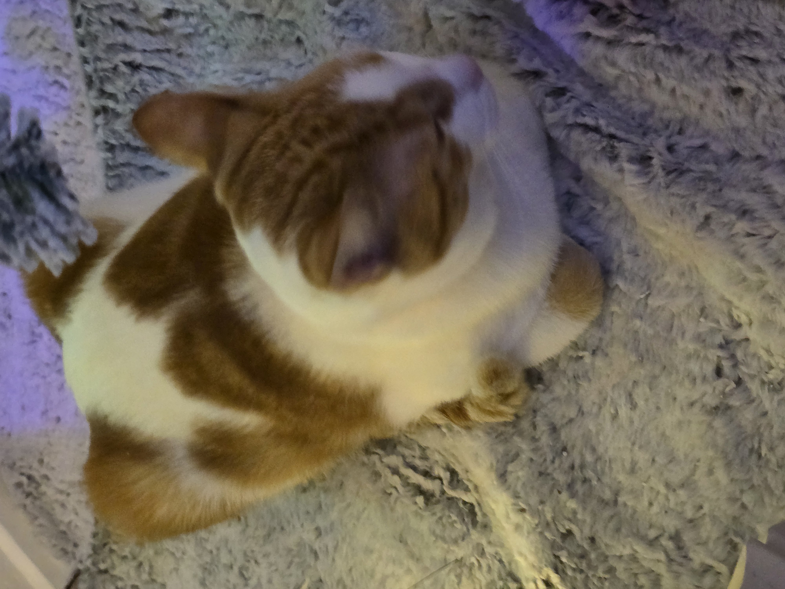

  
  <h1>AK</h1>
  

    <b>Network Architect</b> &nbsp;•&nbsp;
    <b>Infrastructure Engineer</b> &nbsp;•&nbsp;
    <b>Automation Engineer</b> &nbsp;•&nbsp;
    <b>Homelab Enthusiast</b>
  

  
  
  
  
  
  

## System Overview

I build reliable, secure, and automated systems across enterprise infrastructure and containerized environments. My approach combines production-grade observability, CI/CD practices, and isolation by design so services remain resilient as they scale.

## Technical Arsenal

<table>
  <tr>
    <td width="33%" valign="top">
      <h4>🌐 Networking</h4>
       
       
       
      
    </td>
    <td width="33%" valign="top">
      <h4>🤖 Automation &amp; IaC</h4>
       
       
      
    </td>
    <td width="33%" valign="top">
      <h4>🐳 Infrastructure</h4>
       
       
      
    </td>
  </tr>
  <tr>
    <td width="33%" valign="top">
      <h4>⚙️ DevSecOps</h4>
       
      
    </td>
    <td width="33%" valign="top">
      <h4>🔐 Security &amp; Identity</h4>
        
       
    </td>
    <td width="33%" valign="top">
      <h4>📊 Observability</h4>
        
       
    </td>
  </tr>
</table>

## 🏠 Homelab Blueprint

My private lab is the R&amp;D environment for my professional work—a place to test configurations before they reach production.

- **Automation first:** Version-controlled Ansible playbooks and Terraform manifests manage server state and deployments.
- **Hardened security:** pfSense at the edge, strict inter-VLAN routing, local recursive DNS with Unbound, and automated TLS certificate rotation.
- **Production-at-home observability:** Centralized monitoring built around a 99.9% uptime standard.

## 🏗️ [Homelab Stack](https://github.com/stars/variablenix/lists/my-homelab-stack)

Tools, services, and projects powering KDN Lab.

  
  
  
  
  
  
  
  
  
  
  
  
  
  
  
  
  
  
  
  
  
  

## 🎵 [Beyond the Terminal](https://github.com/KDN-Cloud/b.aklein.studio)

  
  
  
  
  
  
  

When I’m not configuring subnets, I’m at **The Sound Booth**, exploring audio engineering, studio automation, and generative audio-visual systems.

